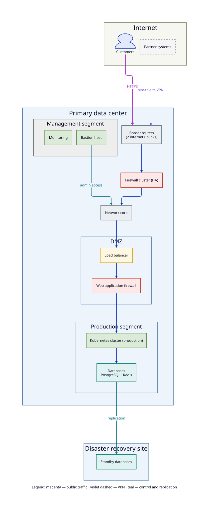
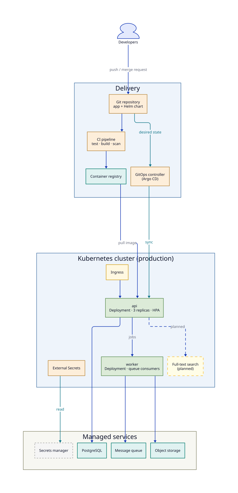
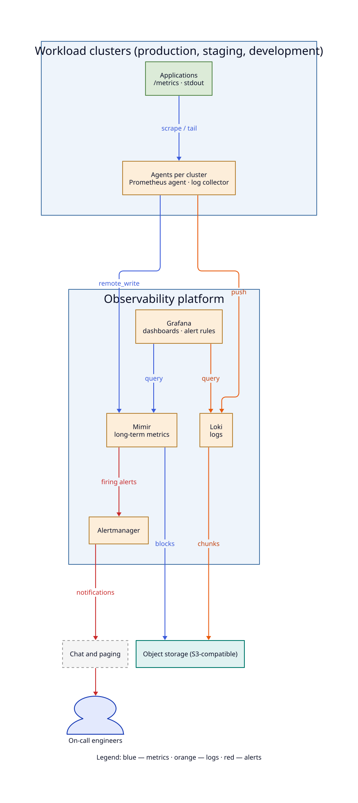
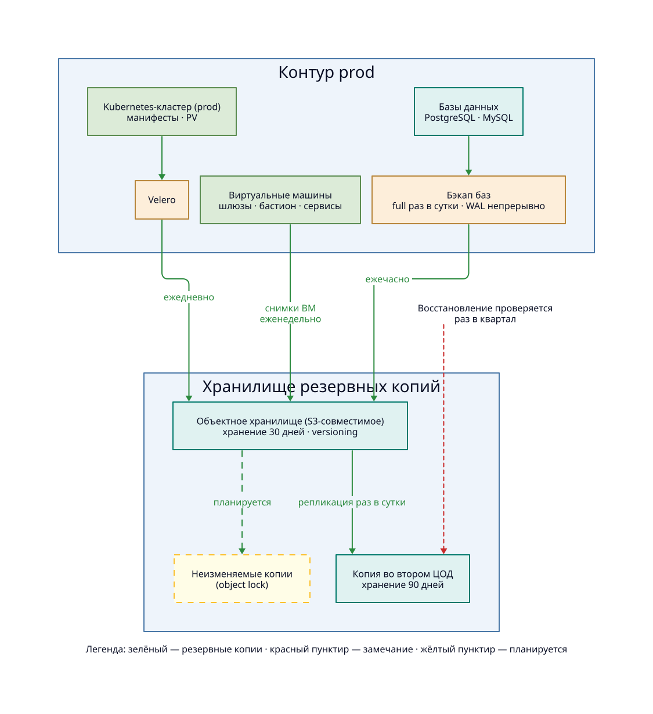
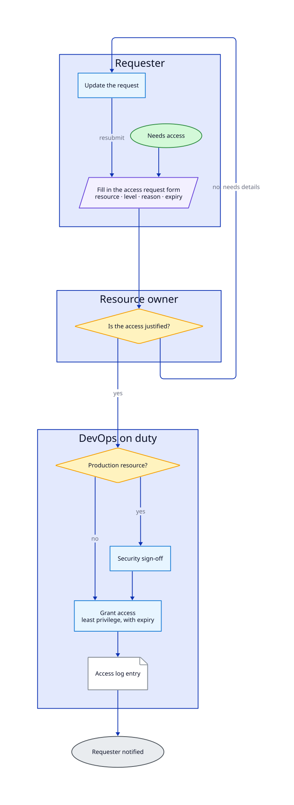
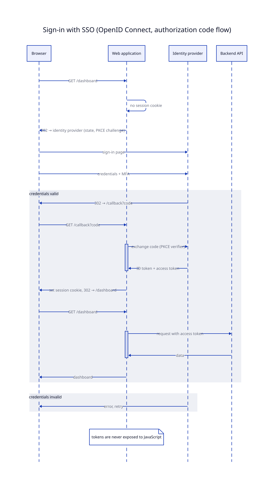
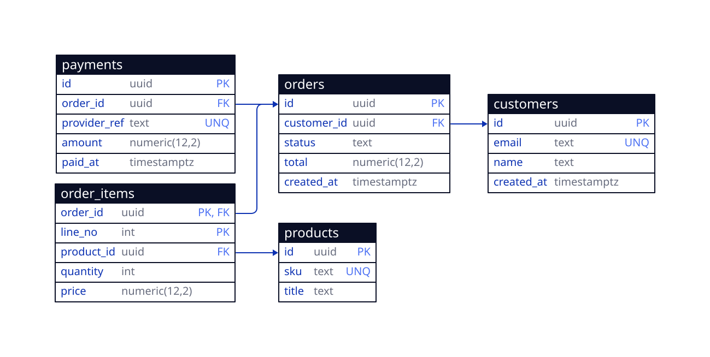
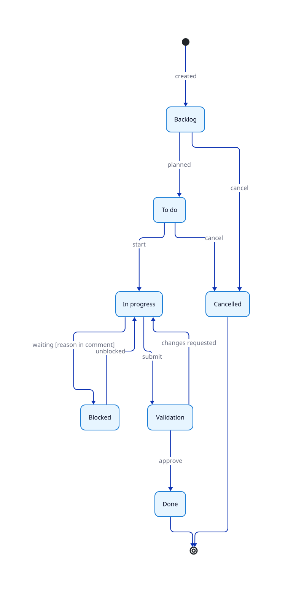

# skill-d2-diagram

**English** · [Русский](README.ru.md)

A [Claude Code](https://docs.claude.com/en/docs/claude-code) skill that turns a description into a diagram in [D2](https://d2lang.com):
architecture and infrastructure, flowcharts, sequence diagrams, ER schemas, UML classes, state machines, org charts —
in one consistent style, reviewed visually, and for real systems drawn from facts and checked before they leave the team.

<p align="center">
  
  
  
  
</p>
<p align="center">
  
  
  
  
</p>

```
› draw our network segmentation for the auditors
› draw the sign-in sequence with SSO and MFA
› here is the migration, draw the ER diagram
› нарисуй схему процесса согласования отпуска
› update the monitoring diagram: logs now go to Loki instead of Elasticsearch
```

## Why

Diagrams drawn by an agent tend to be invented, inconsistent, unreadable and leaky. This skill makes the agent:

- **pick the right diagram type** — flowchart, sequence, ER, UML class, state machine, hierarchy or architecture, with verified D2 snippets for each;
- **draw only what it verified** (for real systems) — `kubectl`, IaC and config repositories, current docs; contradictions are reported, not smoothed over;
- **use one palette** — zones, nodes, process and state shapes, 8 flow types, all distinguishable from each other;
- **look at the result** — render SVG + PNG with ELK, open the PNG, fix unreadable or 5:1 "tape" layouts;
- **not leak internals** — separate external and internal versions, plus a scanner for IPs, MACs, e-mails, hostnames and your own deny-list;
- **catch silent D2 errors** — unknown classes, labels and class members cut at `#`, unreadable tables, `d2 validate` passing broken files.

## What's inside

| Path | Purpose |
|---|---|
| [`SKILL.md`](SKILL.md) | the workflow the agent follows |
| [`references/diagram-types.md`](references/diagram-types.md) | which type to choose, verified snippets per type |
| [`references/style.md`](references/style.md) | the palette (copy-paste `classes` block) |
| [`references/patterns.md`](references/patterns.md) | layout patterns and verified D2 gotchas |
| [`references/terms.md`](references/terms.md) | neutral wording for external diagrams, English and Russian |
| [`scripts/anonymity-check.sh`](scripts/anonymity-check.sh) | finds data that must not be shared outside the team |
| [`scripts/class-check.sh`](scripts/class-check.sh) | finds used-but-undefined classes (d2 ignores them silently) |
| [`examples/`](examples) | example diagrams of every type with rendered SVG |
| [`tests/test.sh`](tests/test.sh) | tests for scripts, docs, examples and every documented gotcha |

## Requirements

| | Version | Check |
|---|---|---|
| Claude Code | any current | `claude --version` |
| d2 | **≥ 0.7.1**, tested with **0.9.0** (ELK is bundled) | `d2 --version` |
| bash | 3.2+ (macOS, Linux, WSL, Git Bash) — for the scripts only | `bash --version` |

## Install

### 1. The skill

Personal skill (all projects):

```bash
git clone https://github.com/MaksimRudakov/skill-d2-diagram.git ~/.claude/skills/d2-diagram
```

Project skill (shared with the repository):

```bash
git clone https://github.com/MaksimRudakov/skill-d2-diagram.git .claude/skills/d2-diagram
```

Prefer keeping clones elsewhere? Clone anywhere and symlink: `ln -s "$PWD/skill-d2-diagram" ~/.claude/skills/d2-diagram`.

Windows (PowerShell): `git clone https://github.com/MaksimRudakov/skill-d2-diagram.git "$env:USERPROFILE\.claude\skills\d2-diagram"`.

The repository is `skill-d2-diagram`, the skill inside is `d2-diagram` — clone into a `d2-diagram` folder as above.
Update with `git pull`; changes apply to new Claude Code sessions.

### 2. d2

| OS | Command |
|---|---|
| macOS | `brew install d2` |
| macOS / Linux, pinned | `curl -fsSL https://d2lang.com/install.sh \| sh -s -- --version v0.9.0` (add `--dry-run` first to see what it does) |
| Windows | `d2-v0.9.0-windows-amd64.msi` from [releases](https://github.com/d2lang/d2/releases/tag/v0.9.0) |
| Any, with Go | `go install oss.terrastruct.com/d2@v0.9.0` |

### 3. Verify

```bash
d2 --version
cd ~/.claude/skills/d2-diagram
bash scripts/anonymity-check.sh examples/network.d2            # anonymity-check.sh: clean
bash scripts/anonymity-check.sh examples/network-internal.d2   # 10 findings, on purpose
```

Then in Claude Code: `draw a diagram of a three-tier web application` or `draw a flowchart of our release process`.

## Language

Instructions are in English; diagrams follow your language:

1. a setting in the project or user `CLAUDE.md` wins — add a line `d2-diagram: language: ru`;
2. otherwise the language you write in (ask in Russian → Russian labels and legend);
3. otherwise English.

Neutral terms and legends for both languages are in [`references/terms.md`](references/terms.md).
D2's default font renders Cyrillic, see [`examples/backup-ru.d2`](examples/backup-ru.d2).

## Checks

### class-check.sh

```bash
bash scripts/class-check.sh diagram.d2
# diagram.d2:12: unknown class 'toool'
```

D2 renders a diagram with a misspelled class without any error — the style is just missing.

### anonymity-check.sh

```bash
bash scripts/anonymity-check.sh [--deny FILE] [--allow FILE] [--skip-comments] diagram.d2
# diagram.d2:7: ipv4: 10.20.0.1/24
# diagram.d2:9: hostname: db01.corp.internal
# diagram.d2:12: deny: FortiGate
```

| Detects | Notes |
|---|---|
| `ipv4` | addresses and CIDR, octets validated; `v1.2.3.4` and `1.2.3.4.5` are not IPs |
| `ipv6` | full and `::`-compressed |
| `mac` | `aa:bb:…`, `aa-bb-…`, `aabb.ccdd.eeff` |
| `email` | |
| `hostname` | FQDNs ending in a real or internal TLD (`.com`, `.kz`, `.internal`, `.local`, `.svc`, …); file names like `values.yaml` and D2 paths like `infra.db` are ignored |
| `deny` | your own EREs: vendors, internal domains, cluster names |

Put project-specific patterns into `.d2-anonymity-deny` and agreed exceptions into `.d2-anonymity-allow`
(one ERE per line) next to the diagrams — they are picked up automatically.
Exit codes: `0` clean, `1` findings, `2` usage error.

It is a heuristic safety net, not a DLP system: the agent still reviews the diagram, and you should too.

## Development

```bash
bash tests/test.sh              # ~120 checks; d2 checks are skipped if d2 is missing
REQUIRE_D2=1 bash tests/test.sh # as in CI
shellcheck scripts/*.sh tests/*.sh
```

CI ([`.github/workflows/ci.yml`](.github/workflows/ci.yml)) runs the tests on Ubuntu and on macOS with the system
`/bin/bash` 3.2 and BSD tools, against a checksum-verified pinned d2, plus shellcheck and gitleaks.
Every gotcha in `references/patterns.md` has a test, so a d2 release that changes behavior fails CI
instead of leaving stale advice. Contributor notes: [`CLAUDE.md`](CLAUDE.md).

## License

[MIT No Attribution (MIT-0)](LICENSE) — copy, modify, redistribute and use commercially, no attribution required.
